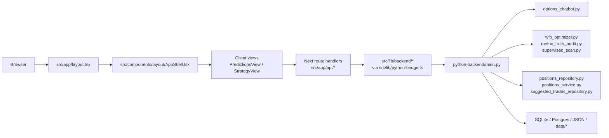

# Architecture Overview

## Critical Rule: Read Code First

- Never answer questions about the codebase, architecture, or design without reading the actual code first.
- Do not speculate from naming, memory, or what "makes sense."
- If asked whether `X` does `Y`, read `X` before answering.
- If asked why `Z` happens, read the relevant path before answering.
- If asked about a design decision, read the implementation before claiming what it does.
- Getting it wrong confidently is worse than saying "let me check."

## What Actually Ships In This Snapshot

The current user-facing browser flow is the supervised options lane:
- scan live options ideas
- inspect replay or truth artifacts
- create tracked positions
- review tracked positions
- manage suggested trades

The active non-browser proof lane is the AI commodity / commodity-infrastructure lane. It is orchestrated by `scripts/run_ai_commodity_opra_progress.py`, uses `data/ai-commodity-infra/universe.json`, and currently treats Alpaca SIP/OPRA bid/ask snapshots labeled `alpaca_opra_daily_snapshot` as the proof source.

The main scan lane defaults to `bullish_pullback_observation` (Bullish Pullback Primary). Despite the legacy ID suffix, this lane is not observation-only; it scans the broad liquid options universe while SPY/QQQ remain the currently historical-ready subset. `quality90_debit55_canary` is the proof/control yardstick and `tracked_winner_primary` is secondary shape guidance.

The current snapshot does not include the old app-facing day-trading route files or `DayTradingLab` component. The `src/app/api/day-trading/*` directories still exist as empty scaffolding folders in this worktree, but they do not currently expose route handlers. Day-trading code still exists in the repo, but it is not part of the active Next.js UI surface shown by this worktree.

## System Map

## Subsystems

### 1. App Shell

Files:
- `src/app/layout.tsx`
- `src/app/page.tsx`
- `src/components/layout/AppShell.tsx`
- `src/components/layout/Header.tsx`
- `src/components/layout/Sidebar.tsx`

Notes:
- `layout.tsx` mounts the full shell.
- `page.tsx` returns `null`, so the shell owns the real user-facing structure.
- `AppShell` dynamically imports the main client views instead of routing between separate pages.

### 2. Client Surfaces

Files:
- `src/components/predictions/PredictionsView.tsx`
- `src/components/strategy/StrategyView.tsx`

Responsibilities:
- manage client-side tabs and forms
- fetch data from Next route handlers
- render scan, replay, tracked-position, and suggestion workflows

Current smell:
- `PredictionsView.tsx` is still the heaviest active client surface
- `StrategyView.tsx` now acts as a coordinator, with `BrainTab.tsx` and `OptimizerTab.tsx` holding most of the rendering

### 3. Next Proxy Layer

Files:
- `src/app/api/*`
- `src/lib/python-bridge.ts`
- `src/lib/backend/*`

Responsibilities:
- keep browser requests same-origin
- normalize JSON parsing and error handling
- forward requests to the FastAPI backend

This layer is intentionally thin. If behavior seems surprising, the real logic usually lives in the Python backend, not in the Next route file.

The backend also exposes support endpoints that are not mirrored through `src/app/api/*` yet, including:
- `/api/profiles`
- `DELETE /api/predictions/{pred_id}`
- `/api/proof-summary`
- `/api/positions/{position_id}/close-prefill`
- `/api/backtest/experiments`
- `/api/backtest/stability`
- `/api/market-data/cache-stats`

Trading Desk position and suggestion routes use an executable lifecycle contract in `src/lib/trading-desk/storeOwnership.ts`.
Tracked-position responses identify the Postgres-backed `tracked_position` store, suggested-trade responses identify the SQLite-backed `suggested_trade` store, and both expose the lifecycle through `x-trading-desk-lifecycle`.
State-changing routes additionally require the explicit mutation intent header defined in `src/lib/trading-desk/mutationIntent.ts`.

### 4. Python Control Plane

Primary file:
- `python-backend/main.py`

Responsibilities:
- FastAPI app wiring
- router mounting and endpoint grouping for scan, replay, positions, suggestions, status, and tools
- report caching
- composition across the core research and storage modules

Current smell:
- `main.py` still does too much at once, but profile/changelog/risk routes have started the router extraction pattern in `python-backend/profile_routes.py`

### 5. Domain Engines

Files:
- `options_chatbot.py`
- `wfo_optimizer.py`
- `supervised_scan.py`
- `metric_truth_audit.py`
- `options_profit_gate.py`
- `options_profit_state.py`

These files hold the business logic:
- live scan construction
- replay and truth-lane analysis
- policy generation
- profitability readiness and forward-evidence checks

### 6. Persistence

Files:
- `python-backend/positions_repository.py`
- `python-backend/positions_service.py`
- `python-backend/suggested_trades_repository.py`

Storage split:
- SQLite for suggested trades and local workflow state
- Postgres for tracked positions and reviews
- `data/options-validation/options_history.db` for imported options truth data
- `data/options-validation/forward_tracking_authoritative.db` and `data/options-validation/forward_tracking.db` for canonical and archive forward evidence
- JSON plus `data/options-profit/*`, `data/forward-tracking/*`, and other `data/*` artifacts for replay, truth, and research outputs

## Request Flow Example

Tracked position create flow:
1. `PredictionsView.tsx` runs `POST /api/scan` and receives picks annotated with forward-evidence source fields when the scan is recorded
2. `PredictionsView.tsx` submits a selected pick to `POST /api/positions`
3. `src/app/api/positions/route.ts` validates the mutation intent and forwards the request
4. `src/lib/python-bridge.ts` sends the request to FastAPI
5. `python-backend/main.py` handles `/api/positions`
6. `python-backend/main.py` verifies the pick's scan lineage against the forward-evidence ledger, including contract identity and recorded execution fields, then `python-backend/positions_service.py` persists the source pick snapshot and only marks the row as live-scan proof when exact execution evidence and verified scan lineage are both present
7. the response comes back through the same chain to the client

Replay summary flow:
1. `StrategyView.tsx` calls `GET /api/backtest/summary`
2. the Next route returns passive Strategy Lab lifecycle headers from `src/lib/strategy-lab/replayIntent.ts`
3. `python-backend/main.py` uses cached report builders around `wfo_optimizer.py` and `metric_truth_audit.py`
4. the aggregated artifact bundle is returned to the UI

Replay/profile mutation flow:
1. `StrategyView.tsx` calls `POST /api/backtest` with `x-strategy-lab-mutation: run_replay_backtest` when the user explicitly runs replay
2. `src/app/api/backtest/route.ts` rejects missing or mismatched Strategy Lab mutation intent before reading the request body
3. the backend runs `wfo_optimizer.run_historical_backtest(save_result=True)`, which writes the latest replay artifact set (`wfo_results.json` for synthetic or `data/options-validation/*` for imported lanes)
4. `StrategyView.tsx` calls `PUT /api/profile` with `x-strategy-lab-mutation: save_strategy_profile` only when the user explicitly saves Policy Editor edits
5. `src/app/api/profile/route.ts` rejects missing or mismatched Strategy Lab mutation intent before forwarding to the backend profile save path

## Storage And Artifact Ownership

- `chat_history.db`
  - written by suggested-trade and local workflow flows
- Postgres via `DATABASE_URL`
  - written by tracked-position create, review, and close flows
- `predictions.json`
  - legacy prediction storage
- `wfo_results.json`
  - latest synthetic replay output written by explicit Strategy Lab replay runs
- `data/options-validation/*`
  - imported options truth store and latest imported replay artifacts written by explicit replay/research runs
- `data/options-validation/options_history.db`
  - imported options truth store
- `data/options-validation/forward_tracking_authoritative.db`
  - canonical forward-evidence ledger
- `data/options-validation/forward_tracking.db`
  - archive forward-evidence ledger
- `data/options-profit/*`
  - options profitability status, live profile, decisions, and candidate artifacts
- `data/forward-tracking/*`
  - forward scan evidence
- `data/ai-commodity-infra/*`
  - AI commodity universe, OPRA capture progress, provider probes, and acquisition plans
- `data/alpaca-options-strategy-lab/*`
  - research-only exact bid/ask strategy lab artifacts
- `market_data.db`
  - market data cache

## Non-Core Or Adjacent Areas

- `src/lib/day-trading/*`
  - legacy or CLI-oriented research code in this snapshot, not an active Next surface
- `src/lib/polymarket/*`
  - experimental or adjacent tooling, not currently wired into the main app shell
- `scripts/run_ai_commodity_opra_progress.py`
  - active proof-lane orchestrator, but not part of the mounted browser product

## Recommended Reading Order For A Senior Engineer

1. `src/components/layout/AppShell.tsx`
2. `src/lib/python-bridge.ts`
3. `src/lib/backend/*`
4. `python-backend/main.py`
5. `src/components/predictions/PredictionsView.tsx`
6. `src/components/strategy/StrategyView.tsx`
7. `options_chatbot.py`
8. `wfo_optimizer.py`
