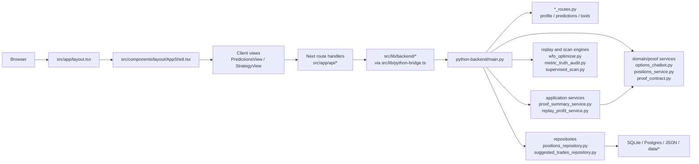

# Architecture Overview

## Critical Rule: Read Code First

- Never answer questions about the codebase, architecture, or design without reading the actual code first.
- Do not speculate from naming, memory, or what "makes sense."
- If asked whether `X` does `Y`, read `X` before answering.
- If asked why `Z` happens, read the relevant path before answering.
- If asked about a design decision, read the implementation before claiming what it does.
- Getting it wrong confidently is worse than saying "let me check."

## What Actually Ships In This Snapshot

Use `docs/architecture-best-practices.md` as the target rubric for future remediation work. This overview is the current system map; the best-practices doc defines the acceptance bars for ownership, boundaries, generated artifacts, verification, and docs hygiene. Use `docs/final-remediation-closure-pack.md` for the generated final readback of the completed 44-point loop, use `docs/living-docs-hygiene.md` for living-doc source-of-truth and generated-artifact hygiene rules, use `docs/generated-artifact-governance.md` for generated artifact trust boundaries and stale handling, use `docs/backend-route-ownership-map.md` for FastAPI adapter ownership and extracted-router/service delegation, and use generated `docs/agent-memory-graph.md` as the quick where-to-go graph for owner docs, code, contracts, and generated artifacts.

The current user-facing browser flow is the supervised options lane:
- scan live options ideas
- inspect replay or truth artifacts
- create tracked positions
- review tracked positions
- manage suggested trades

AI commodity / commodity-infrastructure options is a separate non-browser proof-first strategy lane. Its generated isolation contract is `docs/ai-commodity-isolation.md` with machine-readable guard data in `data/contracts/ai-commodity-isolation.json`. It is orchestrated by `scripts/run_ai_commodity_opra_progress.py`, uses `data/ai-commodity-infra/universe.json`, and currently treats Alpaca SIP/OPRA bid/ask snapshots labeled `alpaca_opra_daily_snapshot` as the proof source.

Some scheduled scan commands fall back to `bullish_pullback_observation` (Bullish Pullback) when no playbook is supplied. That fallback is routing behavior only; every configured regular-options playbook is a peer lane that needs its own profitability, risk, execution, and proof validation. Despite the legacy ID suffix, Bullish Pullback is not observation-only.

The current snapshot does not include the old app-facing day-trading route files or `DayTradingLab` component. The `src/app/api/day-trading/*` directories still exist as empty scaffolding folders in this worktree, but they do not currently expose route handlers. Day-trading code still exists in the repo, but it is not part of the active Next.js UI surface shown by this worktree.

The generated lane-boundary map is `docs/legacy-lane-boundaries.md`, with machine-readable guard data at `data/contracts/legacy-lane-boundaries.json`. Use it before treating crypto options, Polymarket, day-trading, AI commodity, or legacy analytics code as active browser product work.

## System Map

## Subsystems

### 1. App Shell

Files:
- `src/app/layout.tsx`
- `src/app/page.tsx`
- `src/components/layout/AppShell.tsx`
- `src/components/layout/Header.tsx`
- `src/components/layout/Sidebar.tsx`
- `src/lib/navigation/tabs.ts`

Notes:
- `layout.tsx` mounts the full shell.
- `page.tsx` returns `null`, so the shell owns the real user-facing structure.
- `AppShell` dynamically imports the main client views instead of routing between separate pages.
- `src/lib/navigation/tabs.ts` owns typed main app tab IDs and header/sidebar copy.

### 2. Client Surfaces

Files:
- `src/components/predictions/PredictionsView.tsx`
- `src/components/predictions/tradingDeskTabs.ts`
- `src/components/predictions/ScannerTab.tsx`
- `src/components/predictions/ScannerEvidencePanel.tsx`
- `src/components/predictions/ScannerPickRecordForm.tsx`
- `src/components/predictions/useTradingDeskCloseDialogs.ts`
- `src/components/predictions/CloseTradeModal.tsx`
- `src/components/strategy/StrategyView.tsx`

Responsibilities:
- manage client-side tabs and forms
- fetch data from Next route handlers
- render scan, replay, tracked-position, and suggestion workflows
- keep Trading Desk active tab IDs and visible tab IDs in `tradingDeskTabs.ts`, including the `closed-trades` visible-tab to `positions` plus closed-view mapping
- keep scanner table row/mobile-column ownership in `ScannerTab.tsx`, scanner evidence/truth display in `ScannerEvidencePanel.tsx`, and selected-pick scanner record UI in `ScannerPickRecordForm.tsx`
- keep tracked/suggested close-dialog state and close POSTs in `useTradingDeskCloseDialogs.ts`, with the dialog UI in `CloseTradeModal.tsx`
- keep every production `FinTable` call site explicit about mobile cards through `mobileTitleCol`, `mobileSubtitleCol`, and `mobilePriorityCols`; `tests/ui/fin-table.test.js` guards that contract across `src/**/*.tsx`

Current smell:
- `PredictionsView.tsx` is still the heaviest active client coordinator, though scanner, table tabs, record fetching, and close-dialog flows are now split out
- `ScannerTab.tsx` is now a scanner coordinator with the table row model and explicit mobile table contracts still visible while evidence/truth display and selected-pick record rendering live in scanner-only components
- `StrategyView.tsx` now acts as a coordinator, with `BrainTab.tsx` and `OptimizerTab.tsx` holding most of the rendering

### 3. Next Proxy Layer

Files:
- `src/app/api/*`
- `src/lib/python-bridge.ts`
- `src/lib/backend/*`

Responsibilities:
- keep browser requests same-origin
- normalize JSON parsing and error handling
- enforce local operator auth on browser-facing state-changing and tool routes
- forward requests to the FastAPI backend

This layer is intentionally thin. If behavior seems surprising, the real logic usually lives in the Python backend, not in the Next route file.

`src/lib/operator-auth.ts` is the browser-facing write boundary. It reads server-only `OPTIONS_LOCAL_OPERATOR_TOKEN`, accepts `x-options-operator-token`, `Authorization: Bearer ...`, or an HttpOnly `options_local_operator_session` cookie, and fails closed before request body parsing. `OPTIONS_BACKEND_API_TOKEN` is a separate Next-to-FastAPI bridge secret forwarded by `src/lib/backend/transport.ts`; do not use mutation-intent headers as auth.

The backend also exposes support endpoints that are not mirrored through `src/app/api/*` yet, including:
- `/api/profiles`
- `DELETE /api/predictions/{pred_id}`
- `/api/proof-summary`
- `/api/positions/{position_id}/close-prefill`
- `/api/backtest/experiments`
- `/api/backtest/stability`
- `/api/market-data/cache-stats`

Trading Desk position and suggestion routes use an executable lifecycle contract in `src/lib/trading-desk/storeOwnership.ts`.
Tracked-position responses identify the Postgres-backed `tracked_position` store, suggested-trade responses identify the SQLite-backed `suggested_trade` store, and both expose the lifecycle through `x-trading-desk-lifecycle`.
State-changing routes additionally require the explicit mutation intent header defined in `src/lib/trading-desk/mutationIntent.ts`.
Trading Desk, Strategy Lab, and generic route contract IDs are exported as typed readonly ID arrays from their existing owner modules instead of a shared mega-registry.
Trading Desk proof/evidence semantics are owned by `docs/proof-evidence-contract.md` and `data/contracts/proof-evidence-contract.json`; backend row predicates live in `python-backend/proof_contract.py`, while frontend proof display constants flow through generated `src/lib/generated/proofEvidenceContract.ts` and human facade `src/lib/trading-desk/proofContract.ts`. `docs/proof-invariant-table.md` is generated from `data/contracts/proof-invariant-cases.json` as the shared backend/frontend regression matrix for raw exact, production proof, Truth-grade, and realized-P&L boundaries.
Scanner creation safety is owned by `docs/scanner-creation-safety-contract.md` and `data/contracts/scanner-creation-safety-contract.json`; it covers the canonical scanner stage map, scanner-origin route creates, scheduled auto-track, and pending candidate validation dispositions.
Replay/profit ownership is mapped in `docs/replay-profit-contract.md`; replay readback assembly lives in `python-backend/replay_profit_service.py`, while replay engines, scanner policy generation, proof predicates, and profit-cycle state stay in their domain modules.
Trading Desk repository ownership and structural repository interfaces are mapped in `docs/repository-contract.md`; tracked positions are Postgres-owned, suggested trades are SQLite-owned, and memory/SQLite tracked-position repositories are explicit test or legacy-tool doubles only.
Trading Desk tracked/suggested record parity is mapped in `docs/trading-desk-record-parity.md`; `python-backend/repository_parity.py` names the shared lifecycle/row shape and the intentional store, envelope, proof, and lifecycle-event differences.
Trading Desk API body models are mapped in `docs/trading-desk-api-models.md`; `python-backend/trading_desk_api_models.py` gives the six mutation routes narrow Pydantic request-body adapters and top-level envelope drift guards while preserving `dict[str, Any]` FastAPI handlers and route-owned 400 validation.
Trading Desk TypeScript API contracts are mapped in `docs/typescript-api-contracts.md`; `src/lib/trading-desk/apiContracts.ts` names the request and response envelopes consumed by `src/lib/backend/positions.ts`, Next route handlers, and Trading Desk client fetches, while `src/lib/trading-desk/apiResponseValidation.ts` validates only shallow Trading Desk response envelopes at the Next boundary. This remains manual code, not generated OpenAPI/JSON Schema.
The Trading Desk schema bridge is generated by `scripts/generate_trading_desk_schema_bridge.py` into `data/contracts/trading-desk-api-schema-bridge.json` and `docs/trading-desk-schema-bridge.md`. It maps route contracts, manual TypeScript names, and narrow Pydantic adapter JSON Schemas for readability and drift checks only; `runtime_use=false`, and no FastAPI, TypeScript, validation, auth, proof, scanner, or payload behavior changes are implied.
Generic Next route lifecycle headers are mapped in `docs/route-lifecycle-contracts.md`; `src/lib/route-lifecycle/routeContracts.ts` covers scan, predictions, risk/status, local operator session, sectors, and tools through `jsonWithRouteLifecycle()`. These headers are descriptive route/store/lifecycle signals only and do not replace local operator auth, Trading Desk headers, Strategy Lab headers, proof contracts, or response-envelope validation.
The machine-readable route/mutation inventory is generated by `scripts/generate_route_parity.py` into `data/contracts/route-mutation-inventory.json` from the same Next route, FastAPI decorator, client-fetch, and route-contract source signals as `docs/route-parity.md`. It is a drift/readability artifact only and does not define route behavior, payloads, auth, proof, scanner, or DB semantics.
The backend route ownership map is generated by `scripts/generate_backend_route_ownership_map.py` into `data/contracts/backend-route-ownership-map.json` and `docs/backend-route-ownership-map.md`. It statically maps FastAPI route decorators, adapter modules, extracted routers, service delegation, backend-only routes, and owner docs; `runtime_use=false`, and it does not import `main.py` or define route behavior.
The generated storage ownership map lives in `docs/storage-ownership-map.md` and `data/contracts/storage-ownership-map.json`; `scripts/generate_storage_ownership_map.py` joins route store usage with repository migrations, constraints, indexes, local DB roles, route artifacts, and virtual stores for readability and drift checks only.
Generated artifact trust boundaries are mapped in `docs/generated-artifact-governance.md` and `data/contracts/generated-artifact-governance.json`; `scripts/generate_generated_artifact_governance.py` consumes the shared generated-artifact manifest, package scripts, and generated markers to classify runtime posture, stale handling, hand-edit policy, and excluded volatile artifact classes.
The final remediation closure pack is generated by `scripts/generate_final_remediation_closure_pack.py` into `data/contracts/final-remediation-closure-pack.json` and `docs/final-remediation-closure-pack.md`. It proves the 44-point loop is complete, checked, discoverable, and still inside active scope; `runtime_use=false`, and it does not define route, auth, payload, proof, scanner, replay, DB, frontend, profitability, or broker behavior.
Trading Desk local SQLite hardening is mapped in `docs/local-db-hardening.md`; `python-backend/local_db_hardening.py` names active, legacy/test, out-of-scope, and ignored sidecar/backup DB roles, while `scripts/audit_local_databases.py` opens existing SQLite files read-only.
Trading Desk repository migrations are mapped in `docs/repository-migrations.md`; `python-backend/repository_migrations.py` owns the versioned manifest and checksum-guarded ledger helpers.
Trading Desk repository constraints are mapped in `docs/repository-constraints.md`; `python-backend/repository_constraints.py` separates DB-enforced invariants, API/service validators, proof-contract-owned semantics, and deferred DB checks.
Trading Desk repository indexes are mapped in `docs/repository-indexes.md`; `python-backend/repository_indexes.py` separates current read-path indexes from deferred candidates.

### 4. Python Control Plane

Composition root:
- `python-backend/main.py`

Responsibilities:
- FastAPI app wiring
- router mounting and endpoint grouping for scan, replay, positions, suggestions, status, and support routes
- report caching
- composition across the core research and storage modules

Extracted routers:
- `python-backend/profile_routes.py`
- `python-backend/predictions_routes.py`
- `python-backend/tools_routes.py`

Router rule:
- `python-backend/backend_route_context.py` keeps extracted support routers late-bound to the loaded backend module. Do not import canonical `main.py` from route modules, because tests load `main.py` under synthetic module names and patch globals after app creation.

Application services:
- `python-backend/proof_summary_service.py`
- `python-backend/replay_profit_service.py`

Service rule:
- application services are decorator-free workflow builders between FastAPI routes and domain/repository modules. They use `BackendRouteContext` or explicit late-bound providers for mutable backend dependencies, and they must not import canonical `main.py` or redefine proof, scanner, auth, or storage semantics.

Current smell:
- `main.py` still owns the larger scan, replay route adapters, trading-desk, status, sector, and market-data route families. Replay readback assembly is now in `replay_profit_service.py`; future router and service splits should follow the late-bound route context pattern.
- Use `docs/backend-route-ownership-map.md` before backend route edits to see which adapters are inline, which are extracted routers, which delegate to services, and which backend-only routes are not mirrored through Next.

### 5. Domain Engines

Files:
- `options_chatbot.py`
- `wfo_optimizer.py`
- `supervised_scan.py`
- `metric_truth_audit.py`
- `options_profit_gate.py`
- `options_profit_state.py`

These files hold the business logic:
- live scan construction
- replay and truth-lane analysis
- policy generation
- profitability readiness and forward-evidence checks

### 6. Persistence

Files:
- `python-backend/positions_repository.py`
- `python-backend/positions_service.py`
- `python-backend/suggested_trades_repository.py`
- `python-backend/repository_contracts.py`
- `python-backend/repository_parity.py`
- `python-backend/local_db_hardening.py`
- `python-backend/repository_migrations.py`
- `python-backend/repository_constraints.py`
- `python-backend/repository_indexes.py`

Storage split:
- SQLite for suggested trades and local workflow state
- Postgres for tracked positions and reviews
- `data/options-validation/options_history.db` for imported options truth data
- `data/options-validation/forward_tracking_authoritative.db` and `data/options-validation/forward_tracking.db` for canonical and archive forward evidence
- JSON plus `data/options-profit/*`, `data/forward-tracking/*`, and other `data/*` artifacts for replay, truth, and research outputs

Repository rules:
- tracked positions use `TrackedPositionsRepository` and must not silently fall back from Postgres to SQLite
- suggested trades use `SuggestedTradesRepository` and share the review-shaped method surface without tracked-only proof/status capabilities
- tracked/suggested parity is descriptive: shared read/create/review/close and display row shape do not merge Postgres tracked-position proof rows with SQLite paper suggested trades
- local DB hardening is read-only/audit-first: `chat_history.db` is active suggested-trade SQLite, `data/tracked_positions.db` is explicit test/legacy only, and options-history, forward ledgers, market cache, and AI commodity artifacts remain outside this Trading Desk repository contract
- optional tracked-position read optimizations such as `list_compact_positions` and `profit_status_snapshot` stay optional
- schema changes for Trading Desk repositories go through `python-backend/repository_migrations.py` and `docs/repository-migrations.md`; Point 11 records the current inline `init_schema()` DDL as baseline migrations without changing proof, route, auth, scanner, or replay behavior
- constraint ownership goes through `python-backend/repository_constraints.py` and `docs/repository-constraints.md`; proof truth is not encoded as SQL, and broad DB `CHECK` constraints remain deferred until the read-only audit is clean
- index ownership goes through `python-backend/repository_indexes.py` and `docs/repository-indexes.md`; indexes support read paths and are not uniqueness, proof, scanner, or route semantics unless a separate decision says so

## Request Flow Example

Tracked position create flow:
1. `PredictionsView.tsx` runs `POST /api/scan` and receives picks annotated with forward-evidence source fields when the scan is recorded
2. `PredictionsView.tsx` submits a selected pick to `POST /api/positions`
3. `src/app/api/positions/route.ts` validates local operator auth, then validates the mutation intent and forwards the request
4. `src/lib/python-bridge.ts` sends the request to FastAPI
5. `python-backend/main.py` handles `/api/positions`
6. `python-backend/main.py` verifies the pick's scan lineage against the forward-evidence ledger, including contract identity and recorded execution fields, then `python-backend/positions_service.py` persists the source pick snapshot and only marks the row as live-scan proof when exact execution evidence and verified scan lineage are both present
7. the response comes back through the same chain to the client

Replay summary flow:
1. `StrategyView.tsx` calls `GET /api/backtest/summary`
2. the Next route returns passive Strategy Lab lifecycle headers from `src/lib/strategy-lab/replayIntent.ts`
3. `python-backend/main.py` delegates cached readback assembly to `python-backend/replay_profit_service.py`
4. the service reads replay, metric truth, profitability forensics, and comparison builders through `BackendRouteContext`
5. the aggregated artifact bundle is returned to the UI

Replay/profile mutation flow:
1. `StrategyView.tsx` calls `POST /api/backtest` with `x-strategy-lab-mutation: run_replay_backtest` when the user explicitly runs replay
2. `src/app/api/backtest/route.ts` rejects missing local operator auth before reading the body, then rejects missing or mismatched Strategy Lab mutation intent
3. the backend runs `wfo_optimizer.run_historical_backtest(save_result=True)`, which writes the latest replay artifact set (`wfo_results.json` for synthetic or `data/options-validation/*` for imported lanes)
4. `StrategyView.tsx` calls `PUT /api/profile` with `x-strategy-lab-mutation: save_strategy_profile` only when the user explicitly saves Policy Editor edits
5. `src/app/api/profile/route.ts` rejects missing local operator auth before reading the body, then rejects missing or mismatched Strategy Lab mutation intent before forwarding to the backend profile save path

## Storage And Artifact Ownership

- `chat_history.db`
  - written by suggested-trade and local workflow flows
- Postgres via `DATABASE_URL`
  - written by tracked-position create, review, and close flows
- `predictions.json`
  - legacy prediction storage
- `wfo_results.json`
  - latest synthetic replay output written by explicit Strategy Lab replay runs
- `data/options-validation/*`
  - imported options truth store and latest imported replay artifacts written by explicit replay/research runs
- `data/options-validation/options_history.db`
  - imported options truth store
- `data/options-validation/forward_tracking_authoritative.db`
  - canonical forward-evidence ledger
- `data/options-validation/forward_tracking.db`
  - archive forward-evidence ledger
- `data/options-profit/*`
  - options profitability status, live profile, decisions, and candidate artifacts
- `data/forward-tracking/*`
  - forward scan evidence
- `data/ai-commodity-infra/*`
  - AI commodity universe, OPRA capture progress, provider probes, and acquisition plans
- `data/alpaca-options-strategy-lab/*`
  - research-only exact bid/ask strategy lab artifacts
- `market_data.db`
  - market data cache

## Non-Core Or Adjacent Areas

- `src/lib/day-trading/*`
  - legacy or CLI-oriented research code in this snapshot, not an active Next surface
- `src/lib/polymarket/*`
  - experimental or adjacent tooling, not currently wired into the main app shell
- `scripts/run_ai_commodity_opra_progress.py`
  - active proof-lane orchestrator, but not part of the mounted browser product

## Recommended Reading Order For A Senior Engineer

1. `src/components/layout/AppShell.tsx`
2. `src/lib/navigation/tabs.ts`
3. `src/lib/python-bridge.ts`
4. `src/lib/backend/*`
5. `python-backend/main.py`
6. `python-backend/backend_route_context.py`
7. `python-backend/profile_routes.py`
8. `python-backend/predictions_routes.py`
9. `python-backend/tools_routes.py`
10. `python-backend/proof_summary_service.py`
11. `python-backend/replay_profit_service.py`
12. `src/components/predictions/PredictionsView.tsx`
13. `src/components/predictions/tradingDeskTabs.ts`
14. `src/components/predictions/ScannerTab.tsx`
15. `src/components/predictions/ScannerEvidencePanel.tsx`
16. `src/components/predictions/ScannerPickRecordForm.tsx`
17. `src/components/strategy/StrategyView.tsx`
18. `options_chatbot.py`
19. `wfo_optimizer.py`
