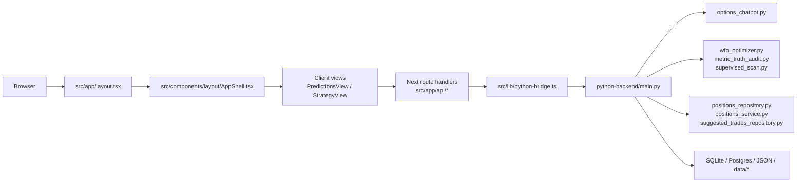

# Architecture Overview

## Critical Rule: Read Code First

- Never answer questions about the codebase, architecture, or design without reading the actual code first.
- Do not speculate from naming, memory, or what "makes sense."
- If asked whether `X` does `Y`, read `X` before answering.
- If asked why `Z` happens, read the relevant path before answering.
- If asked about a design decision, read the implementation before claiming what it does.
- Getting it wrong confidently is worse than saying "let me check."

## What Actually Ships In This Snapshot

The current user-facing browser flow is the supervised options lane:
- scan live options ideas
- inspect replay or truth artifacts
- create tracked positions
- review tracked positions
- manage suggested trades

The current snapshot does not include the old app-facing day-trading routes or `DayTradingLab` component. Day-trading code still exists in the repo, but it is not part of the active Next.js UI surface shown by this worktree.

## System Map

## Subsystems

### 1. App Shell

Files:
- `src/app/layout.tsx`
- `src/app/page.tsx`
- `src/components/layout/AppShell.tsx`
- `src/components/layout/Header.tsx`
- `src/components/layout/Sidebar.tsx`

Notes:
- `layout.tsx` mounts the full shell.
- `page.tsx` returns `null`, so the shell owns the real user-facing structure.
- `AppShell` dynamically imports the main client views instead of routing between separate pages.

### 2. Client Surfaces

Files:
- `src/components/predictions/PredictionsView.tsx`
- `src/components/strategy/StrategyView.tsx`

Responsibilities:
- manage client-side tabs and forms
- fetch data from Next route handlers
- render scan, replay, tracked-position, and suggestion workflows

Current smell:
- both files are large, stateful client components and are the main place where frontend complexity has accumulated

### 3. Next Proxy Layer

Files:
- `src/app/api/*`
- `src/lib/python-bridge.ts`

Responsibilities:
- keep browser requests same-origin
- normalize JSON parsing and error handling
- forward requests to the FastAPI backend

This layer is intentionally thin. If behavior seems surprising, the real logic usually lives in the Python backend, not in the Next route file.

### 4. Python Control Plane

Primary file:
- `python-backend/main.py`

Responsibilities:
- FastAPI app wiring
- endpoint grouping for scan, replay, positions, suggestions, status, and tools
- report caching
- composition across the core research and storage modules

Current smell:
- `main.py` is doing too much at once and is the first candidate for router or service extraction if the backend keeps growing

### 5. Domain Engines

Files:
- `options_chatbot.py`
- `wfo_optimizer.py`
- `supervised_scan.py`
- `metric_truth_audit.py`
- `options_profit_gate.py`
- `options_profit_state.py`

These files hold the business logic:
- live scan construction
- replay and truth-lane analysis
- policy generation
- profitability readiness and forward-evidence checks

### 6. Persistence

Files:
- `python-backend/positions_repository.py`
- `python-backend/positions_service.py`
- `python-backend/suggested_trades_repository.py`

Storage split:
- SQLite for suggested trades and local workflow state
- Postgres for tracked positions and reviews
- JSON plus `data/*` artifacts for replay, truth, and research outputs

## Request Flow Example

Tracked position create flow:
1. `PredictionsView.tsx` submits to `POST /api/positions`
2. `src/app/api/positions/route.ts` validates JSON and forwards the request
3. `src/lib/python-bridge.ts` sends the request to FastAPI
4. `python-backend/main.py` handles `/api/positions`
5. the backend uses the positions repository or service layer to persist and normalize the position
6. the response comes back through the same chain to the client

Replay summary flow:
1. `StrategyView.tsx` calls `GET /api/backtest/summary`
2. the Next route proxies through the bridge
3. `python-backend/main.py` uses cached report builders around `wfo_optimizer.py` and `metric_truth_audit.py`
4. the aggregated artifact bundle is returned to the UI

## Storage And Artifact Ownership

- `chat_history.db`
  - written by suggested-trade and local workflow flows
- Postgres via `DATABASE_URL`
  - written by tracked-position create, review, and close flows
- `predictions.json`
  - legacy prediction storage
- `wfo_results.json`
  - replay output
- `data/options-profit/*`
  - options profitability and truth-gate artifacts
- `data/forward-tracking/*`
  - forward scan evidence
- `market_data.db`
  - market data cache

## Non-Core Or Adjacent Areas

- `src/lib/day-trading/*`
  - legacy or CLI-oriented research code in this snapshot, not an active Next surface
- `src/lib/polymarket/*`
  - experimental or adjacent tooling, not currently wired into the main app shell

## Recommended Reading Order For A Senior Engineer

1. `src/components/layout/AppShell.tsx`
2. `src/lib/python-bridge.ts`
3. `python-backend/main.py`
4. `src/components/predictions/PredictionsView.tsx`
5. `src/components/strategy/StrategyView.tsx`
6. `options_chatbot.py`
7. `wfo_optimizer.py`
