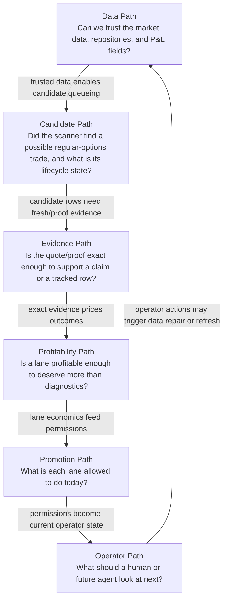

# Project Operating Map

Generated by `scripts/generate_project_pathway_registry.py`. Do not hand-edit this file.

This is the visual operating model for the active options project. It organizes the repo by pathway instead of by script name.

It is a navigation and explanation layer only. It does not create trades, submit broker orders, lower proof bars, change scanner policy, or replace the owner docs listed below.

## One-Screen Model

## Short Form

- Data first.
- Candidates second.
- Evidence third.
- Profitability fourth.
- Promotion fifth.
- Operator action last.

## Pathways

| Pathway | Question | Main Owners | Main Artifacts | Failure Mode |
|---|---|---|---|---|
| Data Path | Can we trust the market data, repositories, and P&L fields? | scripts/audit_repository_constraints.py, scripts/import_thetadata_options_nbbo.py, scripts/audit_paid_data_readiness.py, scripts/repair_historical_backfill_realized_pnl.py | data/options-validation/options_history.db, chat_history.db, DATABASE_URL, data/forward-tracking/historical_suggested_close_realized_pnl_repair_v1_latest.json | Bad data makes every downstream pick, P&L, and blocker suspect. |
| Candidate Path | Did the scanner find a possible regular-options trade, and what is its lifecycle state? | scripts/ensure_daily_all_lanes_audit_ran.py, scripts/pending_audit_candidates.py, scripts/validate_pending_scan_candidates.py, scripts/candidate_lifecycle.py | data/forward-tracking/regular_guardrail_starvation_latest.json, data/forward-tracking/pending_scan_candidates.jsonl, data/forward-tracking/pending_scan_candidate_validation_latest.json, data/contracts/candidate-lifecycle-contract.json | Selected candidates can vanish or be mislabeled if queue/lifecycle status handling drifts. |
| Evidence Path | Is the quote/proof exact enough to support a claim or a tracked row? | scripts/generate_proof_evidence_contract.py, scripts/generate_proof_invariant_table.py, scripts/build_regular_options_fresh_evidence_loop.py, scripts/log_scan_picks.py | data/contracts/proof-evidence-contract.json, src/lib/generated/proofEvidenceContract.ts, data/forward-tracking/fill_attempts.jsonl, data/forward-tracking/regular_options_fresh_evidence_loop_latest.json | A row can look profitable while still being proof-ineligible or paper-only. |
| Profitability Path | Is a lane profitable enough to deserve more than diagnostics? | scripts/audit_missed_regular_picks_outcomes.py, scripts/analyze_missed_regular_picks_failure_modes.py, scripts/analyze_missed_regular_picks_filter_matrix.py, scripts/build_regular_profitability_operating_scorecard.py | data/forward-tracking/missed_regular_picks_outcome_latest.json, data/forward-tracking/missed_regular_picks_failure_modes_latest.json, data/forward-tracking/missed_regular_picks_filter_matrix_latest.json, data/profitability-lab/regular-options-operating-scorecard/latest.json | Clean data can still prove the strategy is losing. |
| Promotion Path | What is each lane allowed to do today? | scripts/lane_promotion_state.py, scripts/build_current_policy_circuit_breaker.py, scripts/validate_current_policy_entry_filter_walkforward.py, scripts/monitor_current_policy_entry_filter_paper.py | data/forward-tracking/lane_promotion_state_latest.json, data/forward-tracking/current_policy_circuit_breaker_latest.json, data/forward-tracking/current_policy_entry_filter_walkforward_latest.json, data/forward-tracking/current_policy_entry_filter_paper_monitor_latest.json | A historically promising lane can be promoted too early without fresh forward/risk evidence. |
| Operator Path | What should a human or future agent look at next? | scripts/generate_project_pathway_registry.py, scripts/build_project_operator_gateboard.py, scripts/build_regular_profitability_operating_scorecard.py | data/contracts/project-pathway-registry.json, data/forward-tracking/project_operator_gateboard_latest.json, docs/project-operator-gateboard.md, docs/regular-options-operating-scorecard.md | The project becomes technically correct but impossible to hold in your head. |

## What To Read When Confused

### Data Path

- Plain English: This path proves the raw material is usable before anyone argues about picks.
- Question: Can we trust the market data, repositories, and P&L fields?
- Owner docs: `["docs/repository-constraints.md", "docs/storage-ownership-map.md", "docs/paid-options-data-import-checklist.md", "docs/NEXT_STEPS.md"]`
- Owner scripts: `["scripts/audit_repository_constraints.py", "scripts/import_thetadata_options_nbbo.py", "scripts/audit_paid_data_readiness.py", "scripts/repair_historical_backfill_realized_pnl.py"]`
- Primary artifacts: `["data/options-validation/options_history.db", "chat_history.db", "DATABASE_URL", "data/forward-tracking/historical_suggested_close_realized_pnl_repair_v1_latest.json"]`
- Gates:
  - Closed production/unclassified tracked rows must have realized P&L.
  - Closed suggested trades must have stored exit/P&L.
  - Historical repairs must use trusted exact OPRA/NBBO quotes.
  - Daily/EOD, midpoint, stale, last-trade, or display marks are not production proof.

### Candidate Path

- Plain English: This path turns scanner output into queued, diagnostic, paper-only, or validation-attempted candidate rows.
- Question: Did the scanner find a possible regular-options trade, and what is its lifecycle state?
- Owner docs: `["docs/scanner-creation-safety-contract.md", "docs/candidate-lifecycle-contract.md", "docs/regular-guardrail-starvation-audit.md"]`
- Owner scripts: `["scripts/ensure_daily_all_lanes_audit_ran.py", "scripts/pending_audit_candidates.py", "scripts/validate_pending_scan_candidates.py", "scripts/candidate_lifecycle.py"]`
- Primary artifacts: `["data/forward-tracking/regular_guardrail_starvation_latest.json", "data/forward-tracking/pending_scan_candidates.jsonl", "data/forward-tracking/pending_scan_candidate_validation_latest.json", "data/contracts/candidate-lifecycle-contract.json"]`
- Gates:
  - All supervised lanes must be audited for no-pick explanations.
  - Clear candidates are queued, not silently dropped.
  - Candidate statuses must come from the lifecycle contract.
  - Pending validation reruns must use portfolio caps and current lane gates.

### Evidence Path

- Plain English: This path separates fresh executable OPRA/NBBO evidence from research, paper, stale, midpoint, and lifecycle-only rows.
- Question: Is the quote/proof exact enough to support a claim or a tracked row?
- Owner docs: `["docs/proof-evidence-contract.md", "docs/proof-invariant-table.md", "docs/regular-options-fresh-evidence-loop.md"]`
- Owner scripts: `["scripts/generate_proof_evidence_contract.py", "scripts/generate_proof_invariant_table.py", "scripts/build_regular_options_fresh_evidence_loop.py", "scripts/log_scan_picks.py"]`
- Primary artifacts: `["data/contracts/proof-evidence-contract.json", "src/lib/generated/proofEvidenceContract.ts", "data/forward-tracking/fill_attempts.jsonl", "data/forward-tracking/regular_options_fresh_evidence_loop_latest.json"]`
- Gates:
  - Production proof requires fresh live scanner exact-contract evidence and verified lineage.
  - Exact realized P&L requires trusted exit evidence.
  - Broker paper fills and research/backfill rows do not become production proof.
  - Fresh evidence loop must reconcile candidate, fill attempt, tracked link, and exact realized P&L.

### Profitability Path

- Plain English: This path prices selected candidates and converts broad scanner enthusiasm into lane-level evidence.
- Question: Is a lane profitable enough to deserve more than diagnostics?
- Owner docs: `["docs/missed-regular-picks-outcome-audit.md", "docs/missed-regular-picks-failure-modes.md", "docs/missed-regular-picks-filter-matrix.md", "docs/regular-options-operating-scorecard.md"]`
- Owner scripts: `["scripts/audit_missed_regular_picks_outcomes.py", "scripts/analyze_missed_regular_picks_failure_modes.py", "scripts/analyze_missed_regular_picks_filter_matrix.py", "scripts/build_regular_profitability_operating_scorecard.py"]`
- Primary artifacts: `["data/forward-tracking/missed_regular_picks_outcome_latest.json", "data/forward-tracking/missed_regular_picks_failure_modes_latest.json", "data/forward-tracking/missed_regular_picks_filter_matrix_latest.json", "data/profitability-lab/regular-options-operating-scorecard/latest.json"]`
- Gates:
  - Lanes need enough exact priced rows, positive average net P&L, and profit factor.
  - Unprofitable or undersampled lanes remain diagnostic-only.
  - Profitable historical pockets start as paper/probation, not live release.
  - Counterfactual filters must be entry-time-only and survive later-date/OOS checks.

### Promotion Path

- Plain English: This path turns profitability, walk-forward, fresh-paper, risk, and circuit-breaker evidence into lane permissions.
- Question: What is each lane allowed to do today?
- Owner docs: `["docs/lane-promotion-state.md", "docs/current-policy-circuit-breaker.md", "docs/current-policy-entry-filter-walkforward.md", "docs/current-policy-entry-filter-paper-monitor.md"]`
- Owner scripts: `["scripts/lane_promotion_state.py", "scripts/build_current_policy_circuit_breaker.py", "scripts/validate_current_policy_entry_filter_walkforward.py", "scripts/monitor_current_policy_entry_filter_paper.py"]`
- Primary artifacts: `["data/forward-tracking/lane_promotion_state_latest.json", "data/forward-tracking/current_policy_circuit_breaker_latest.json", "data/forward-tracking/current_policy_entry_filter_walkforward_latest.json", "data/forward-tracking/current_policy_entry_filter_paper_monitor_latest.json"]`
- Gates:
  - Lanes move diagnostic -> paper_probation -> live_validation -> auto_track.
  - Live validation needs clean lane profitability, walk-forward depth, fresh exact paper rows, and clean current risk.
  - Auto-track remains reserved for explicit later release review.
  - Recent broken cohorts route to paper validation only.

### Operator Path

- Plain English: This path turns many artifacts into one current readback and a small set of next actions.
- Question: What should a human or future agent look at next?
- Owner docs: `["docs/project-operating-map.md", "docs/project-operator-gateboard.md", "docs/regular-options-operator-workflow.md", "docs/NEXT_STEPS.md"]`
- Owner scripts: `["scripts/generate_project_pathway_registry.py", "scripts/build_project_operator_gateboard.py", "scripts/build_regular_profitability_operating_scorecard.py"]`
- Primary artifacts: `["data/contracts/project-pathway-registry.json", "data/forward-tracking/project_operator_gateboard_latest.json", "docs/project-operator-gateboard.md", "docs/regular-options-operating-scorecard.md"]`
- Gates:
  - Gateboard is read-only and summarizes current state.
  - Operator next actions must preserve proof bars and lane promotion gates.
  - Docs index and worklog must point future agents to the right pathway owner.

## Mental Check

When the project feels tangled, translate any artifact into one of these questions:

1. Is the data trustworthy?
2. Did the scanner produce candidates?
3. Is the evidence proof-grade or paper/diagnostic?
4. Is the lane profitable?
5. What is the lane allowed to do?
6. What should the operator do next?
