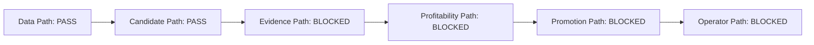

# Project Operator Gateboard

Produced by `scripts/build_project_operator_gateboard.py` as a current readback. Rebuild it with `npm run options:gateboard`.

This is read-only. It explains where the project is blocked without changing scanner, broker, proof, stop, or lane-promotion behavior.

## At A Glance

- Overall status: `safe_blocked_no_live_release`
- Generated at UTC: `2026-06-08T15:40:25Z`
- Primary message: Data is readable, but release is intentionally blocked in Evidence Path, Profitability Path, Promotion Path, Operator Path.

## Current Flow

## Pathway Status

| Pathway | State | Meaning | Evidence |
| --- | --- | --- | --- |
| Data Path | `pass` | Trusted repository data is clean for current readbacks. | audit_status=pass_or_skipped; hard_violation_count=0; diagnostic_count=0; sqlite_suggested_trades=pass; postgres_tracked_positions=pass |
| Candidate Path | `pass` | Candidate statuses are centralized and current candidates are visible. | lifecycle_contract=loaded; fresh_candidate_count=34; candidate_status_counts={"diagnostic_only_lane_profitability_gate": 4, "live_validation_attempted": 22, "paper_validation_only_lane_profitability_gate": 8} |
| Evidence Path | `blocked` | Fresh evidence is visible, but nothing is promotion-ready. | candidate_count=34; fresh_exact_entry_count=6; linked_position_count=1; exact_realized_pnl_count=0; promotion_discussion_ready_count=0; validation_outcome_counts={"created": 1, "diagnostic_only": 4, "no_longer_matched": 16, "paper_only": 8, "proof_ineligible": 5} |
| Profitability Path | `blocked` | Data is clean, but broad missed-pick economics are negative. | priced_rows=210/210; mark_unpriced_count=0; tracked_pnl_complete=4/4; untracked_rows=206; untracked_winners=70; untracked_losers=136; untracked_avg_net_pnl_pct=-15.28%; untracked_profit_factor=0.34; lane_gate_allowed_count=1; lane_gate_blocked_count=7 |
| Promotion Path | `blocked` | No regular lane is live-validation or auto-track eligible. | lane_count=14; diagnostic_lane_count=13; paper_probation_lane_count=1; live_validation_lane_count=0; auto_track_lane_count=0; global_live_exact_negative_count=1; open_risk_governor_status=open_risk_governor_blocked; live_policy_change=False |
| Operator Path | `blocked` | Operator readback is complete, but no paper/live candidates are eligible. | paper_shortlist_release_gate=no_paper_shortlist_candidates; eligible_paper_review_candidates=0; scorecard_status=visible_product_profitability_progress_but_proof_still_blocked; paper_gate_status=paper_only_no_live_release; open_risk_governor_status=open_risk_governor_blocked; open_risk_governor_blockers=["live_exact_negative_open_risk"]; suggested_open_rows=1; suggested_attention_trade_count=1; ai_commodity_verified=False; ai_commodity_shared_quote_dates=3/100 |

## Operator Next Actions

- Keep live validation and auto-track disabled until promotion-state rows move beyond paper/probation.
- Use the gateboard first when answering whether a blocker is data, evidence, profitability, promotion, or operator visibility.
- Do not treat all clear scanner rows equally; investigate entry-time-only filters and lanes that can earn back from diagnostics.
- Collect fresh executable exact entry/exit evidence before discussing live promotion.
- During the next valid market-data window, rerun all-lanes audit, pending validation, fresh evidence loop, and lane promotion readbacks.

## No-Chase Manifest

- Status: `no_chase_active`
- Reason count: `6`
- Live policy change: `False`

| Reason | Severity | Evidence |
| --- | --- | --- |
| broad_missed_pick_economics_negative | block_live_release | {"avg_net_pnl_pct": -15.28, "profit_factor": 0.34, "untracked_rows": 206} |
| no_live_validation_lanes | block_live_validation | {"auto_track_lane_count": 0, "paper_probation_lane_count": 1} |
| open_risk_governor_blocked_or_missing | block_new_scanner_origin_entries | {"blockers": ["live_exact_negative_open_risk"], "live_exact_negative_ids": [537], "status": "open_risk_governor_blocked"} |
| no_promotion_ready_fresh_evidence | block_promotion_discussion | {"exact_exit_bridge_count": 1, "paper_probation_bridge_count": 8} |
| no_eligible_paper_shortlist_candidates | block_operator_chase | {"fresh_bridge_blocker_counts": {"guardrail_not_clear": 9, "lane_signature_not_matched": 8, "no_tier_a_lane_match": 15}, "release_gate_status": "no_paper_shortlist_candidates"} |
| suggested_trade_review_attention_required | refresh_before_using_suggested_pnl | {"attention_trade_ids": [138]} |

### Prohibited Actions

- do_not_open_live_or_auto_track_rows_from_blocked_readbacks
- do_not_chase_paper_or_historical_signature_rows_without_fresh_exact_bridge
- do_not_use_stale_midpoint_eod_manual_or_display_only_marks_as_proof

## Source Artifacts

| Artifact | Available | Status | Generated |
| --- | --- | --- | --- |
| pathway_registry: `data/contracts/project-pathway-registry.json` | True | project_pathway_registry | n/a |
| candidate_lifecycle: `data/contracts/candidate-lifecycle-contract.json` | True | candidate_lifecycle_contract | n/a |
| missed_regular_picks_outcome: `data/forward-tracking/missed_regular_picks_outcome_latest.json` | True | missed_regular_picks_outcome | 2026-06-05T19:35:21Z |
| fresh_evidence_loop: `data/forward-tracking/regular_options_fresh_evidence_loop_latest.json` | True | fresh_evidence_loop_readback | 2026-06-06T07:21:33Z |
| open_position_risk: `data/forward-tracking/regular_open_position_risk_latest.json` | True | n/a | 2026-06-06T07:21:23Z |
| suggested_trade_close_risk: `data/forward-tracking/suggested_trade_close_risk_latest.json` | True | n/a | 2026-06-05T17:28:57Z |
| lane_promotion_state: `data/forward-tracking/lane_promotion_state_latest.json` | True | lane_promotion_state_readback | 2026-06-06T07:21:44Z |
| paper_shortlist: `data/profitability-lab/regular-options-paper-shortlist/latest.json` | True | paper_shortlist_readback | 2026-06-04T23:05:21Z |
| operating_scorecard: `data/profitability-lab/regular-options-operating-scorecard/latest.json` | True | visible_product_profitability_progress_but_proof_still_blocked | 2026-06-05T17:28:57Z |
| ai_commodity_progress: `data/ai-commodity-infra/progress/latest.json` | True | n/a | n/a |

## Non-Goals

- create trades
- submit broker orders
- change scanner policy
- change lane promotion policy
- lower proof bars
- turn paper/research/backfill rows into production proof
